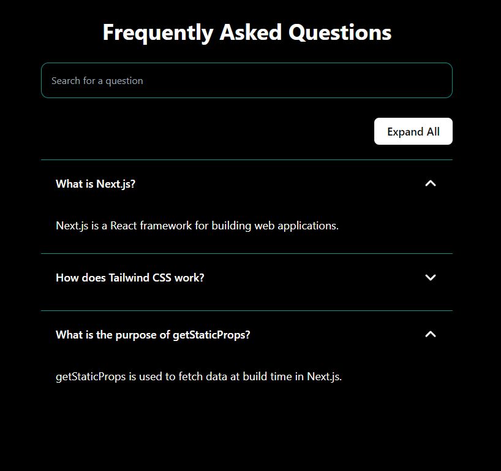

# Frontend Mentor - QR code component solution

This is a quick mockup of an faq page, with requirements set by a challenge on [HireUp](https://www.usehireup.com/):

Requirements

**Static Route:**

- Create a page at /faq that displays a list of FAQ items.
- Each FAQ item should consist of a question and an answer.

**Simulated FAQ Data:**

- Use a local array of objects to simulate the FAQ data.
- Each FAQ object should have a question and an answer.

**Search Functionality:**

- Implement a search bar at the top of the page that filters the FAQ items based on the text input.
- The search should be case-insensitive and should match the search term against the questions.

**Accordion Functionality:**

- Each FAQ question should be clickable to toggle the visibility of the answer.
- When a question is clicked, the corresponding answer should expand below it.
- If the question is clicked again, the answer should collapse.

**Responsive Design:**

- The page should be fully responsive and look good on both desktop and mobile devices.
- Use Tailwind CSS for all styling.

**Bonus Challenges**

- Expand/Collapse All: Add buttons to expand or collapse all FAQ items at once.
- Persist Search State: Save the user's search query in the URL so that it persists across page reloads.

**Submission should be a single .js file containing:**

- A functional Next.js page at /faq.
- All necessary code to implement the FAQ accordion with search functionality.
- Styling implemented with Tailwind CSS directly in the file.

## Table of contents

- [Overview](#overview)
  - [Screenshot](#screenshot)
  - [Links](#links)
  - [Built with](#built-with)
- [Author](#author)

## Overview

The FAQ page is located at /faq and is built with Next.js with Tailwind CSS for styling.

### Screenshot

### Links

- Live Site URL: [GitHub Pages URL](https://richardzhang01.github.io/faq-page/)

### Built with

- [Tailwind CSS](https://tailwindcss.com/)
- [Next.js](https://nextjs.org/) - React framework

## Author

- Linkedin - [@yRichardZhang](https://www.linkedin.com/in/richard-zhiyuan-zhang/)

